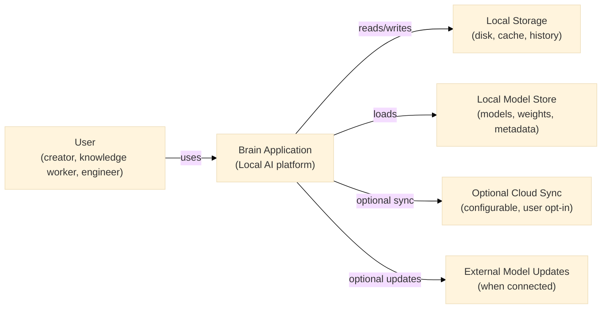
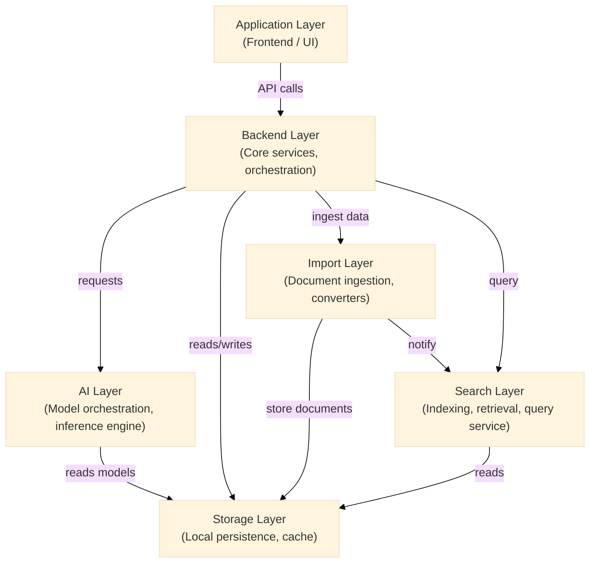
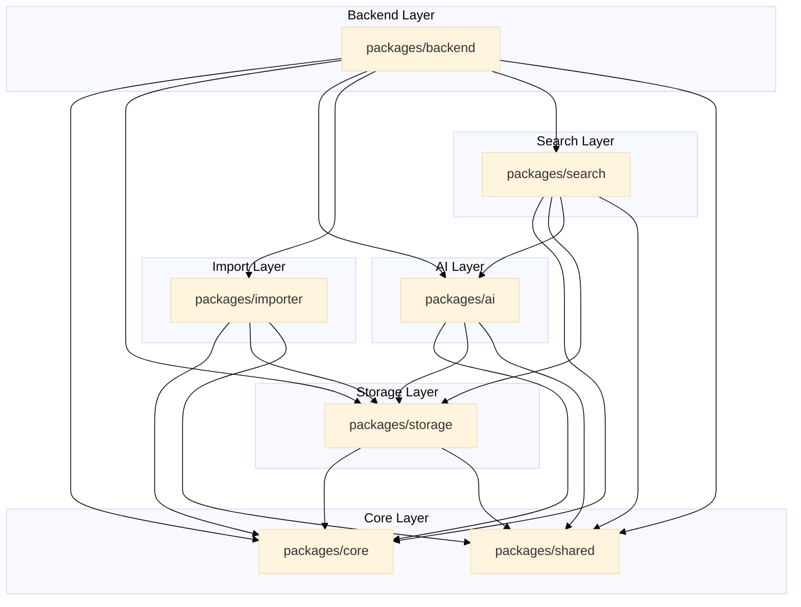
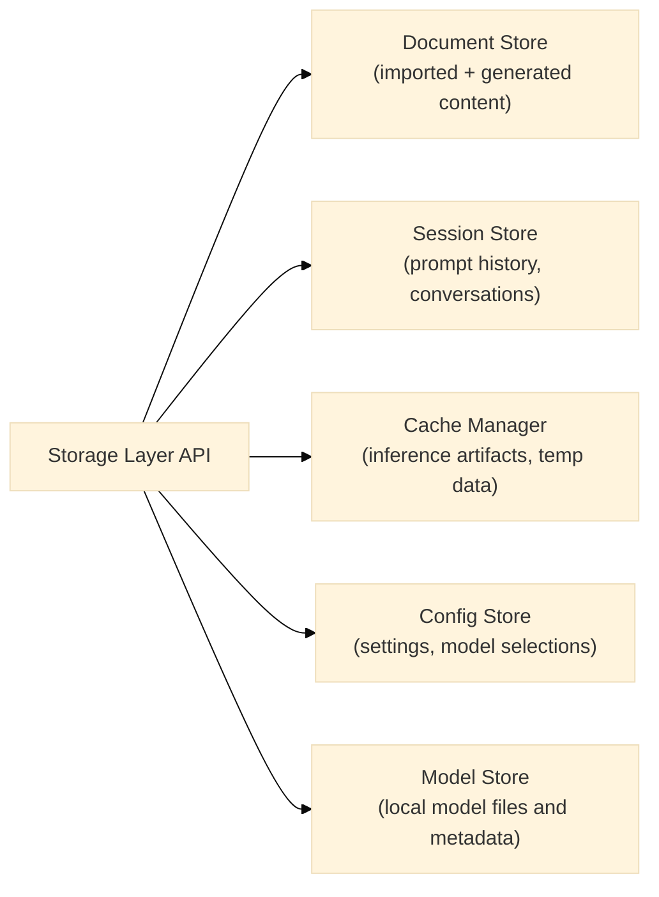
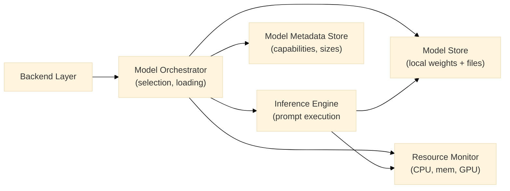
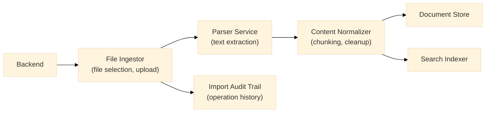
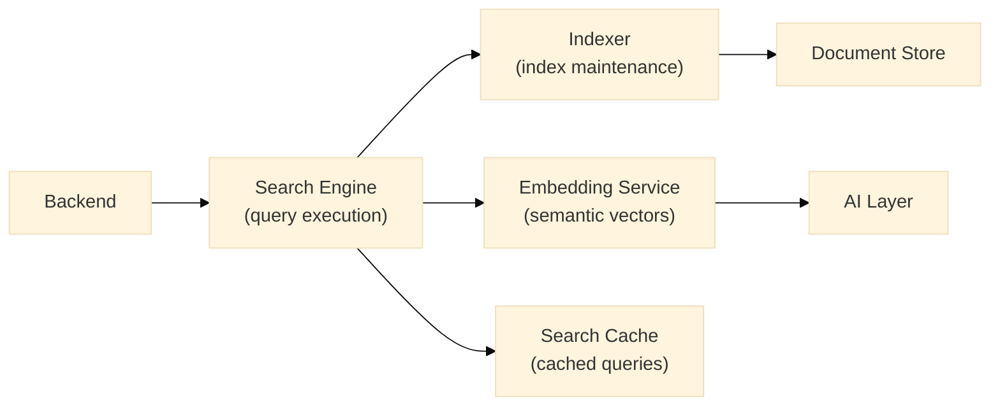
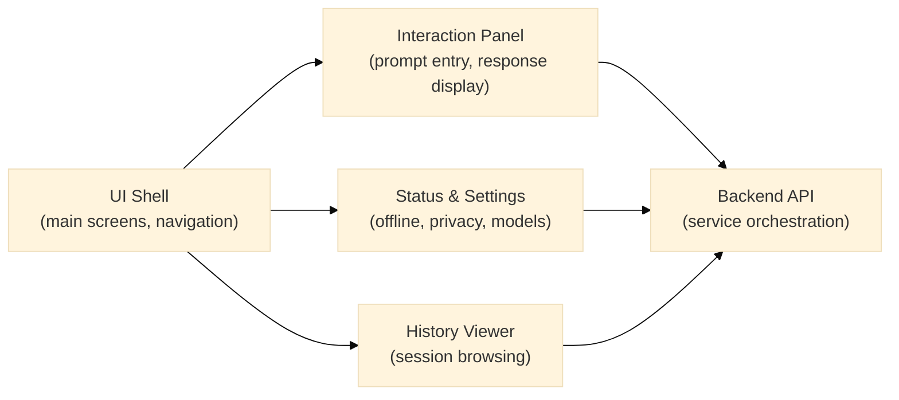
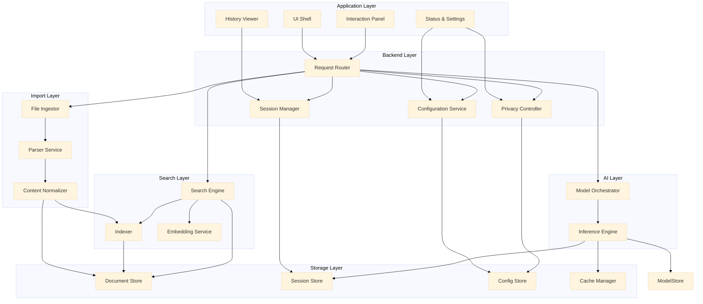

# Software Architecture Document

## Overview

This document describes the architecture of Brain as a local-first AI platform. It defines the system context, containers, components, storage, AI, import, search, and application layers. The design is aligned to C4 architecture principles and includes Mermaid diagrams to illustrate system boundaries, runtime containers, and component interactions.

## Architectural Principles

- Local-first execution: prioritize on-device inference and offline capability.
- Clear separation of concerns: isolate data handling, AI processing, search, and application logic.
- Modular extensibility: support future integrations through well-defined interfaces.
- Privacy by design: keep user data local and minimize external dependencies.
- Resilience: ensure the system degrades gracefully when resources are constrained.

## System Context

Brain is a desktop-focused AI platform that operates primarily on the user’s local device. It interacts with external resources only when optional sync or updates are enabled.

### System Context Diagram

### System Context Narrative

- The primary actor is the end user, who runs Brain on a local desktop machine.
- Brain interacts with local storage for persistent session data, content, and model metadata.
- It uses a local model store for AI inference with downloaded or preinstalled models.
- Optional integrations, such as cloud sync or external model updates, are available only when the user opts in.

## Containers

Brain is decomposed into logical containers representing major runtime subsystems.

### Container Diagram

### Container Responsibilities

- Application Layer: user interface and user experience handling.
- Backend Layer: orchestration of features, security, session management, and inter-container communication.
- AI Layer: model management and inference orchestration.
- Storage Layer: persistent storage of content, sessions, and metadata.
- Import Layer: document ingestion, transformation, and content extraction.
- Search Layer: indexing, retrieval, and search query processing.

## Components

Each container contains components with single responsibilities.

### Application Layer Components

- UI Shell: main application window, navigation, and workspace layout.
- Interaction Panel: prompt entry, response display, and refinement controls.
- Status & Settings: offline state, model selection, privacy settings, onboarding.
- History Viewer: session history, search, and restore capabilities.

### Backend Layer Components

- Session Manager: stores and retrieves active session state.
- Request Router: routes frontend requests to the appropriate subsystem.
- Privacy Controller: enforces local data handling rules and user consent.
- Configuration Service: loads and persists user preferences and settings.
- Notification Hub: broadcasts status and error updates to the UI.

### AI Layer Components

- Model Orchestrator: selects, loads, and switches between local models.
- Inference Engine: executes inference with local models and returns outputs.
- Model Metadata Store: tracks available models, resource requirements, and capabilities.
- Resource Monitor: observes CPU, memory, and device capacity for inference.

### Storage Layer Components

- Document Store: persistent storage for imported files and generated content.
- Session Store: local history and active session persistence.
- Cache Manager: temporary storage for inference artifacts, tokenized contexts, and intermediate results.
- Config Store: user settings, model selections, and privacy choices.

### Import Layer Components

- File Ingestor: accepts supported file formats and converts them into structured content.
- Parser Service: extracts text and metadata from documents.
- Content Normalizer: cleans, chunks, and prepares imported content for search and AI context.
- Import Audit Trail: records ingestion operations for review and reuse.

### Search Layer Components

- Indexer: builds and updates searchable indexes from imported content.
- Search Engine: processes queries and returns relevant results.
- Embedding Service: creates local embeddings for search and semantic retrieval.
- Search Cache: caches query results for faster repeat retrieval.

## Package Responsibilities

This section maps logical responsibilities to the repository’s package structure.

### `packages/core`

- Core orchestration services and runtime plumbing.
- Application bootstrapping and dependency injection.
- Common lifecycle management and event dispatching.

### `packages/backend`

- Backend services and API implementations for the desktop application.
- Request routing, privacy enforcement, and configuration management.
- Backend bridges to local storage, AI, import, and search subsystems.

### `packages/ai`

- AI interfaces, model loading, inference orchestration, and prompt utilities.
- Embeddings and local model configuration.
- AI prompts, template management, and model lifecycle utilities.

### `packages/storage`

- Local persistence abstractions and storage drivers.
- Session history, document store, cache manager, and config store implementations.
- Storage schemas, serialization, and data integrity checks.

### `packages/importer`

- Document ingestion services and file parsing logic.
- Format-specific converters, text extraction, and content normalization.
- Import audit and pipeline orchestration.

### `packages/search`

- Search indexing and retrieval services.
- Semantic search utilities and embedding orchestration.
- Search query processing and local search cache.

### `packages/shared`

- Shared utilities, types, and constants used across packages.
- Common error handling, logging, and model metadata definitions.

## Dependency Rules

The architecture enforces clear dependency directions to avoid coupling and improve maintainability.

- `packages/core` is the foundation and may be consumed by all other packages.
- `packages/backend` may depend on `packages/core`, `packages/storage`, `packages/ai`, `packages/importer`, `packages/search`, and `packages/shared`.
- `packages/ai` may depend on `packages/core`, `packages/storage`, and `packages/shared`.
- `packages/storage` may depend on `packages/core` and `packages/shared`, but not on `packages/backend`, `packages/ai`, `packages/importer`, or `packages/search`.
- `packages/importer` may depend on `packages/core`, `packages/storage`, and `packages/shared`, but not on `packages/backend`, `packages/ai`, or `packages/search`.
- `packages/search` may depend on `packages/core`, `packages/storage`, `packages/ai` (for embeddings), and `packages/shared`, but not on `packages/backend`.
- `packages/shared` must be dependency-free of application-specific packages and may be consumed by all packages.

### Dependency Rule Diagram

## Storage Layer

The storage layer provides persistent local storage for user content, session data, model metadata, and configuration.

### Responsibilities

- Persist user-generated content and imported documents.
- Maintain searchable indexes and cached AI artifacts.
- Store session history and application state.
- Store user preferences, model selections, and privacy settings.

### Storage Layer Diagram

### Storage Layer Patterns

- Use an append-only history model for session data to preserve recoverability.
- Keep content and metadata separate from binary model artifacts.
- Provide transactional update semantics for user settings and model selection.
- Use a local storage abstraction that can map to native desktop storage APIs or file-based persistence.

### Storage Layer Data Flow

- Document imports are written to Document Store and indexed for search.
- User prompts and AI outputs are recorded in Session Store.
- Model metadata and selection state are persisted in Config Store.
- Temporary inference state and caches are handled by Cache Manager.

## AI Layer

The AI layer orchestrates local model execution and manages model lifecycle.

### Responsibilities

- Manage locally available AI models and model metadata.
- Load and unload models according to user selection and resource constraints.
- Execute inference requests and return responses to the backend.
- Monitor local compute resources to avoid overload.

### AI Layer Diagram

### AI Layer Patterns

- Maintain a model registry that tracks available local models and their resource profiles.
- Separate model selection from inference execution to enable dynamic switching.
- Provide a retry and fallback mechanism when a model fails to load or execute.
- Expose monitoring data for the UI to display performance and status.

## Import Layer

The import layer handles file ingestion and content extraction.

### Responsibilities

- Accept documents from the user and convert them into structured internal representations.
- Extract text, metadata, and attachments from supported formats.
- Normalize imported content for search and AI context.
- Record import operations for audit and reuse.

### Import Layer Diagram

### Import Layer Patterns

- Use pluggable parsers for new document types.
- Normalize text to preserve semantic context and reduce noise.
- Chunk content to support efficient search and AI retrieval.
- Keep import processing local and offline by default.

## Search Layer

The search layer provides retrieval and semantic search capabilities.

### Responsibilities

- Index imported content and generated output for fast retrieval.
- Perform search queries and return ranked results.
- Use local embeddings to support semantic search and relevance.
- Cache frequently used query results for performance.

### Search Layer Diagram

### Search Layer Patterns

- Organize indexes by document and session content for efficient retrieval.
- Use embeddings to improve recall and relevance for semantically related queries.
- Cache rich query results to reduce repeated computation.
- Keep search results local and private.

## Application Layer

The application layer is responsible for user interaction, orchestration of workflows, and state management.

### Responsibilities

- Provide the user-facing UI and manage navigation.
- Route user actions to backend services and update the view.
- Maintain the active session and collaboration context.
- Present status, errors, and guidance to the user.

### Application Layer Diagram

## Component Interactions

### C4 Component Diagram

## Deployment Considerations

- Brain is built as a desktop application with a bundled frontend and backend runtime.
- Model artifacts are installed locally, and the architecture should support safe storage of model files outside the main application runtime.
- The architecture should support optional external updates for models and the application.
- Local storage paths and permissions should be explicitly managed to ensure private data remains on the device.

## Security and Privacy Considerations

- Keep all user-generated content and imported documents in local storage by default.
- Avoid implicit cloud communication; require explicit user opt-in for any external sync or update.
- Enforce least privilege for file access and data persistence.
- Implement transparent user notifications for data operations and model activity.

## Evolution Strategy

- Start with a stable local architecture that can be extended with optional hybrid features later.
- Keep the core storage, AI, and import boundaries stable to allow future additions without major refactoring.
- Add new model capabilities, search enhancements, and integration points through clearly defined interfaces.
- Preserve the local-first promise while enabling optional cloud-assisted workflows when those features are introduced.
